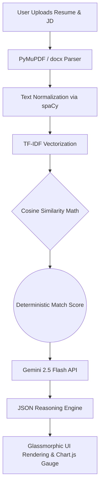

<div align="center">
  <h1>🚀 VibeOnJob | Hybrid AI Resume Analyzer</h1>
  <p><strong>A Next-Generation Resume Evaluation Engine powered by Deterministic NLP & Generative AI.</strong></p>
</div>

<hr>

## 📖 Project Overview

**VibeOnJob** is an advanced application that analyzes a candidate's resume against a targeted job description. Unlike standard applications that merely act as an "LLM wrapper" by dumping raw text into ChatGPT, VibeOnJob utilizes a **Dual-Phase Hybrid Architecture** to mathematically quantify a candidate's fit before generating contextual, actionable career advice.

## 🏗 Architecture

To ensure high evaluation standards, the application processes documents in two distinct phases:

### Phase 1: Deterministic Machine Learning (NLP)
Using `scikit-learn` and `spaCy`, the system extracts raw text and runs it through a highly reliable **TF-IDF Vectorizer**. It calculates the **Cosine Similarity** between the resume and the job description to generate a mathematically sound, reproducible "Match Score". 

### Phase 2: Contextual LLM Reasoning (GenAI)
The deterministic score and raw text are then passed directly into the **Google Gemini API**. The LLM operates strictly within a structural prompt to analyze the *why*, identifying specific skills bridging the gap, and generating a rigorous JSON output containing an exact learning path and resume rewrite suggestions.



## 🛠 Technologies Used

| Layer | Technology | Purpose |
|-------|------------|---------|
| **Backend Framework** | FastAPI | High-performance async API routing & server |
| **Data Parsing** | PyMuPDF (`fitz`), `python-docx` | Reliable file text extraction in-memory |
| **NLP & Machine Learning** | `scikit-learn`, `spaCy` | Term Frequency Vectorization and NER |
| **Generative AI** | Google Gemini SDK | Contextual reasoning and recommendations |
| **Frontend/UI** | Vanilla JS, CSS3, HTML5 | Dynamic glassmorphism design, zero-build |
| **Data Visualization** | Chart.js | Rendering the animated NLP score gauge |
| **Observability** | Python `logging` | Detailed trace of metrics and latency |

## 🚀 How to Run Guide

### Prerequisites
- Python 3.10+ installed
- Google Gemini API Key

### Installation Steps

1. **Clone or Download the Repository:**
   Navigate into the project directory:
   ```bash
   cd ~/dev/vibeonjob
   ```

2. **Set up the Virtual Environment:**
   ```bash
   python3 -m venv venv
   source venv/bin/activate
   ```

3. **Install Dependencies & Language Models:**
   ```bash
   pip install -r requirements.txt
   python -m spacy download en_core_web_sm
   ```

4. **Configure Environment Variables:**
   ```bash
   export GOOGLE_API_KEY="your-gemini-api-key"
   ```

5. **Start the Application:**
   ```bash
   uvicorn main:app --reload
   ```

6. **Access the Interface:**
   Open your browser to [http://localhost:8000](http://localhost:8000)

## 📚 Resources & References
- [FastAPI Documentation](https://fastapi.tiangolo.com/)
- [scikit-learn TF-IDF Vectorizer](https://scikit-learn.org/stable/modules/generated/sklearn.feature_extraction.text.TfidfVectorizer.html)
- [spaCy Linguistic Features](https://spacy.io/usage/linguistic-features)
- [Google Gemini API Docs](https://ai.google.dev/docs)
- [PyMuPDF Details](https://pymupdf.readthedocs.io/en/latest/)
