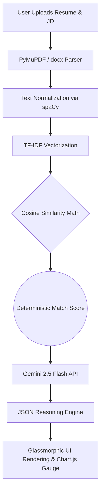
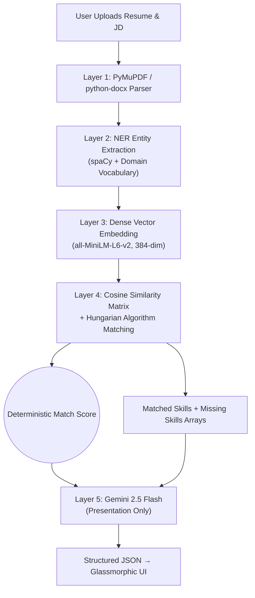

<div align="center">
  <h1>🚀 VibeOnJob | Hybrid AI Resume Analyzer</h1>
  <p><strong>Entity-Level Semantic Matching Engine powered by NER, Dense Embeddings &amp; Hungarian Algorithm Optimization.</strong></p>
</div>

<hr>

## 📖 Project Overview

**VibeOnJob** is an advanced application that analyzes a candidate's resume against a targeted job description. Unlike standard applications that merely act as an "LLM wrapper" by dumping raw text into ChatGPT, VibeOnJob utilizes a **Dual-Phase Hybrid Architecture** to mathematically quantify a candidate's fit before generating contextual, actionable career advice.

## 🏗 Architecture

To ensure high evaluation standards, the application processes documents in two distinct phases:

### Phase 1: Deterministic Machine Learning (NLP)
Using `scikit-learn` and `spaCy`, the system extracts raw text and runs it through a highly reliable **TF-IDF Vectorizer**. It calculates the **Cosine Similarity** between the resume and the job description to generate a mathematically sound, reproducible "Match Score". 

### Phase 2: Contextual LLM Reasoning (GenAI)
The deterministic score and raw text are then passed directly into the **Google Gemini API**. The LLM operates strictly within a structural prompt to analyze the *why*, identifying specific skills bridging the gap, and generating a rigorous JSON output containing an exact learning path and resume rewrite suggestions.


```mermaid
graph TD
    A[User Uploads Resume & JD] --> B[PyMuPDF / docx Parser]
    B --> C[Text Normalization via spaCy]
    C --> D[TF-IDF Vectorization]
    D --> E{Cosine Similarity Math}
    E --> F((Deterministic Match Score))
    F --> G[Gemini 2.5 Flash API]
    G --> H[JSON Reasoning Engine]
    H --> I[Glassmorphic UI Rendering & Chart.js Gauge]
```

**VibeOnJob** is an advanced resume evaluation engine that compares a candidate's resume against a job description using a **5-layer hybrid pipeline**. Unlike naive approaches that dump raw text into an LLM, this system extracts specific data points via NER, encodes them into dense vector spaces with a local transformer model, and uses optimal bipartite matching to produce a mathematically provable match score — before the LLM ever touches the data.

## 🏗 Architecture — 5-Layer Processing Pipeline


```mermaid
graph TD
    A[User Uploads Resume & JD] --> B["Layer 1: PyMuPDF / python-docx Parser"]
    B --> C["Layer 2: NER Entity Extraction<br/>(spaCy + Domain Vocabulary)"]
    C --> D["Layer 3: Dense Vector Embedding<br/>(all-MiniLM-L6-v2, 384-dim)"]
    D --> E["Layer 4: Cosine Similarity Matrix<br/>+ Hungarian Algorithm Matching"]
    E --> F((Deterministic Match Score))
    E --> G["Matched Skills + Missing Skills Arrays"]
    F --> H["Layer 5: Gemini 2.5 Flash<br/>(Presentation Only)"]
    G --> H
    H --> I["Structured JSON → Glassmorphic UI"]
```

### Layer 1 — Document Parsing
- **PyMuPDF** and **python-docx** extract raw text from uploaded PDFs/DOCX files in-memory (no disk writes).

### Layer 2 — Named Entity Recognition (NER)
- **spaCy NER** + a curated **domain vocabulary** of 100+ tech skills extract only the relevant entities (skills, tools, concepts) from both documents.
- This is **dimensionality reduction** — stripping away filler like "I am a hardworking student" and focusing on data points that matter.

### Layer 3 — Dense Vector Embeddings
- Extracted entities are encoded into **384-dimensional dense vectors** using HuggingFace's `all-MiniLM-L6-v2` via `sentence-transformers`.
- Runs **locally on CPU in milliseconds**. Understands semantic meaning: `"React"` ≈ `"Frontend"`, completely solving the vocabulary gap problem.

### Layer 4 — Cosine Similarity Matrix + Hungarian Algorithm
- A full **cosine similarity matrix** is computed between all JD entity vectors and all Resume entity vectors.
- The **Hungarian algorithm** (`scipy.optimize.linear_sum_assignment`) finds the optimal bipartite alignment — the mathematically best 1:1 mapping between JD requirements and candidate skills.
- Output: a provable integer match score + structured arrays of matched/missing skills.

### Layer 5 — LLM Presentation Layer
- **Gemini 2.5 Flash** receives **only structured arrays** — never raw text.
- Its sole job: translate `{matched_skills: [...], missing_skills: [...]}` into polished, human-readable career advice.

## 🛠 Technologies Used

| Layer | Technology | Purpose |
|-------|------------|---------|
| **Backend Framework** | FastAPI | High-performance async API routing & server |
| **Data Parsing** | PyMuPDF (`fitz`), `python-docx` | Reliable file text extraction in-memory |
| **NLP & Machine Learning** | `scikit-learn`, `spaCy` | Term Frequency Vectorization and NER |
| **Generative AI** | Google Gemini SDK | Contextual reasoning and recommendations |
| **Frontend/UI** | Vanilla JS, CSS3, HTML5 | Dynamic glassmorphism design, zero-build |
| **Data Visualization** | Chart.js | Rendering the animated NLP score gauge |
| **Observability** | Python `logging` | Detailed trace of metrics and latency |
| **Backend** | FastAPI | Async API framework |
| **Parsing** | PyMuPDF, python-docx | In-memory document text extraction |
| **NLP/NER** | spaCy (en_core_web_sm) | Named Entity Recognition + lemmatization |
| **Embeddings** | sentence-transformers (MiniLM) | Local 384-dim dense vector encoding |
| **Math/Optimization** | scipy (Hungarian Algorithm) | Optimal bipartite skill alignment |
| **Generative AI** | Google Gemini 2.5 Flash | Presentation-layer formatting only |
| **Frontend** | Vanilla JS, CSS3, Chart.js | Glassmorphic UI with interactive gauge |
| **Observability** | Python logging | Multi-level pipeline tracing |

## 🚀 How to Run

### Prerequisites
- Python 3.10+
- Google Gemini API Key ([Get one here](https://aistudio.google.com/app/apikey))

### Setup

```bash
# Clone & enter
cd ~/dev/vibeonjob

# Virtual environment
python3 -m venv venv
source venv/bin/activate

# Install dependencies
pip install -r requirements.txt
python -m spacy download en_core_web_sm

# Set API key
export GOOGLE_API_KEY="your-key-here"

# Start server
uvicorn main:app --reload
```

Open [http://localhost:8000](http://localhost:8000) in your browser.

> **Note:** First run will auto-download the MiniLM embedding model (~80MB). Subsequent runs load from cache.

## 📚 Resources & References

- [FastAPI Documentation](https://fastapi.tiangolo.com/)
- [sentence-transformers (MiniLM)](https://www.sbert.net/docs/pretrained_models.html)
- [Hungarian Algorithm (scipy)](https://docs.scipy.org/doc/scipy/reference/generated/scipy.optimize.linear_sum_assignment.html)
- [spaCy NER](https://spacy.io/usage/linguistic-features#named-entities)
- [Google Gemini API](https://ai.google.dev/docs)
- [PyMuPDF](https://pymupdf.readthedocs.io/en/latest/)
- [Cosine Similarity](https://en.wikipedia.org/wiki/Cosine_similarity)
