# VibeOnJob — UML Diagrams & Flowcharts

> All diagrams use [Mermaid](https://mermaid.js.org/) syntax.

---

## Table of Contents

1. [System Architecture — Component Diagram](#1-system-architecture--component-diagram)
2. [6-Layer Analysis Pipeline — Flowchart](#2-6-layer-analysis-pipeline--flowchart)
3. [Class Diagram — Backend Services](#3-class-diagram--backend-services)
4. [Class Diagram — Data Models](#4-class-diagram--data-models)
5. [Class Diagram — Pydantic Schemas](#5-class-diagram--pydantic-schemas)
6. [Sequence Diagram — Resume Analysis Flow](#6-sequence-diagram--resume-analysis-flow)
7. [Sequence Diagram — Authentication Flow](#7-sequence-diagram--authentication-flow)
8. [Activity Diagram — Document Parsing (Layer 1)](#8-activity-diagram--document-parsing-layer-1)
9. [Activity Diagram — LLM Engine Retry & Fallback](#9-activity-diagram--llm-engine-retry--fallback)
10. [State Diagram — Analysis Lifecycle](#10-state-diagram--analysis-lifecycle)
11. [ER Diagram — Database Schema](#11-er-diagram--database-schema)
12. [Deployment Diagram](#12-deployment-diagram)
13. [Use Case Diagram](#13-use-case-diagram)
14. [Frontend Component Tree](#14-frontend-component-tree)
15. [Data Flow Diagram — Full Pipeline](#15-data-flow-diagram--full-pipeline)

---

## 1. System Architecture — Component Diagram

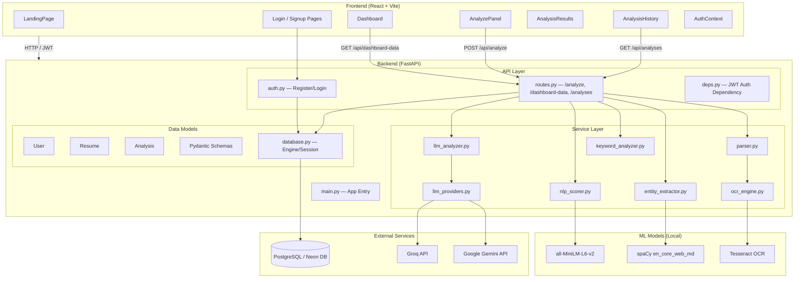

---

## 2. 6-Layer Analysis Pipeline — Flowchart

```mermaid
flowchart TD
    START([User uploads Resume + JD]) --> L1

    subgraph L1["Layer 1 — Document Parsing"]
        L1A{File type?}
        L1B[parse_pdf — PyMuPDF]
        L1C[parse_docx — python-docx]
        L1D[parse_image — OCR Engine]
        L1E[Raw Text Output]
        L1A -->|PDF| L1B
        L1A -->|DOCX| L1C
        L1A -->|JPG/PNG| L1D
        L1B --> L1E
        L1C --> L1E
        L1D --> L1E
    end

    L1E --> L1_CHECK{Text empty?}
    L1_CHECK -->|Yes| ERR1[Return 400 Error]
    L1_CHECK -->|No| L2

    subgraph L2["Layer 2 — NER Entity Extraction"]
        L2A[Preprocess text]
        L2B[spaCy NER pass — ORG, PRODUCT]
        L2C[Noun chunk dependency parse]
        L2D[Union & canonicalize vs ATS seeds]
        L2E["JD entities + Resume entities"]
        L2A --> L2B
        L2A --> L2C
        L2B --> L2D
        L2C --> L2D
        L2D --> L2E
    end

    L2E --> L2_CHECK{JD entities empty?}
    L2_CHECK -->|Yes| ERR2[Return 400 Error]
    L2_CHECK -->|No| L25

    subgraph L25["Layer 2.5 — ATS Keyword Density"]
        L25A[Count JD keyword frequencies]
        L25B[Count resume keyword frequencies]
        L25C[Compute gap severity per skill]
        L25D[Rank by JD frequency — highest priority first]
        L25E[Compute ATS score percentage]
        L25A --> L25B --> L25C --> L25D --> L25E
    end

    L25E --> L3

    subgraph L3["Layer 3 — Dense Vector Embedding"]
        L3A["Encode JD entities → 384-dim vectors (MiniLM)"]
        L3B["Encode Resume entities → 384-dim vectors"]
        L3A --> L3C[JD + Resume vector matrices]
        L3B --> L3C
    end

    L3C --> L4

    subgraph L4["Layer 4 — Cosine Similarity + Hungarian Matching"]
        L4A["Compute cosine similarity matrix (n×m)"]
        L4B["Hungarian algorithm — optimal bipartite assignment"]
        L4C{"similarity ≥ 0.45?"}
        L4D[Matched skills list]
        L4E[Missing skills list]
        L4F[Compute match_score percentage]
        L4G[Re-run keyword analysis with definitive missing list]
        L4A --> L4B --> L4C
        L4C -->|Yes| L4D
        L4C -->|No| L4E
        L4D --> L4F
        L4E --> L4F
        L4F --> L4G
    end

    L4G --> L5

    subgraph L5["Layer 5 — LLM Presentation"]
        L5A[Build structured prompt with pre-computed data]
        L5B[Send to LLM Engine — Gemini → Groq fallback]
        L5C[Parse JSON response — up to 3 retries]
        L5D[Override LLM numbers with pipeline-computed values]
        L5E[Build AnalysisResponse]
        L5A --> L5B --> L5C --> L5D --> L5E
    end

    L5E --> PERSIST[Persist Analysis to DB]
    PERSIST --> RESPOND([Return AnalysisResponse to client])
```

---

## 3. Class Diagram — Backend Services

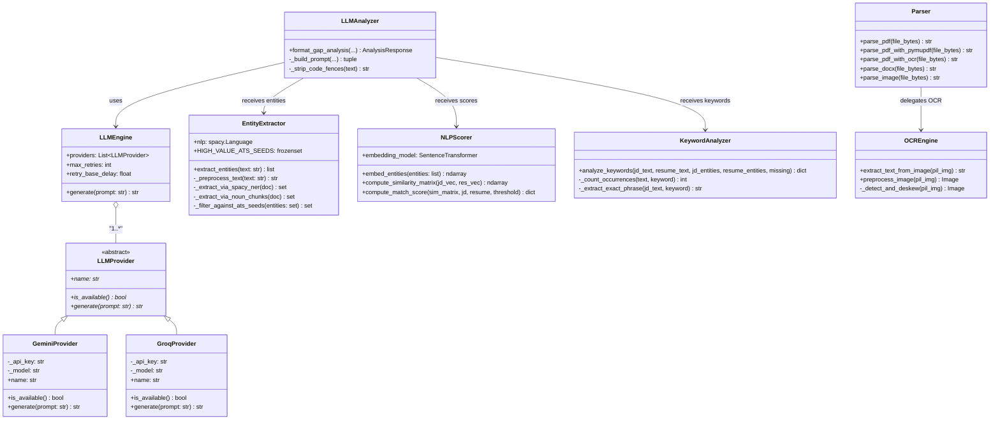

---

## 4. Class Diagram — Data Models

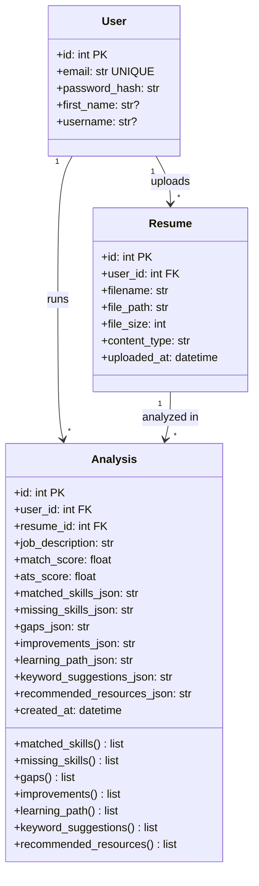

---

## 5. Class Diagram — Pydantic Schemas

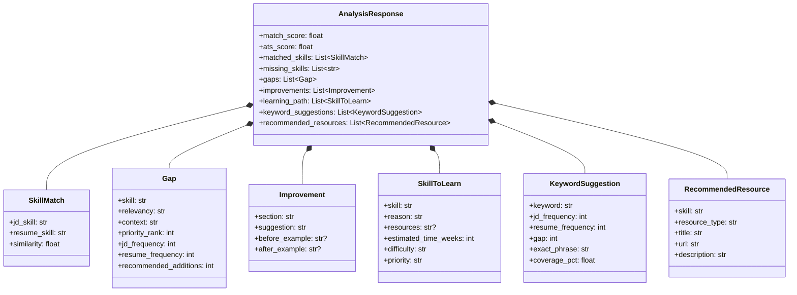

---

## 6. Sequence Diagram — Resume Analysis Flow

```mermaid
sequenceDiagram
    actor U as User
    participant FE as Frontend
    participant API as FastAPI Router
    participant PA as Parser
    participant EE as EntityExtractor
    participant KA as KeywordAnalyzer
    participant NS as NLPScorer
    participant LA as LLMAnalyzer
    participant LE as LLMEngine
    participant GEM as Gemini API
    participant DB as Database

    U->>FE: Upload resume + paste JD
    FE->>API: POST /api/analyze (multipart)
    API->>API: Verify JWT token
    API->>DB: Save Resume record

    rect rgb(40, 40, 80)
        Note over API,PA: Layer 1 — Document Parsing
        API->>PA: parse_pdf / parse_docx / parse_image
        PA-->>API: resume_text
    end

    rect rgb(40, 80, 40)
        Note over API,EE: Layer 2 — NER Entity Extraction
        API->>EE: extract_entities(job_description)
        EE-->>API: jd_entities
        API->>EE: extract_entities(resume_text)
        EE-->>API: resume_entities
    end

    rect rgb(80, 60, 40)
        Note over API,KA: Layer 2.5 — ATS Keyword Density
        API->>KA: analyze_keywords(jd, resume, entities, missing)
        KA-->>API: keyword_report + ats_score
    end

    rect rgb(80, 40, 80)
        Note over API,NS: Layer 3 & 4 — Embedding + Matching
        API->>NS: embed_entities(jd_entities)
        NS-->>API: jd_vectors [n×384]
        API->>NS: embed_entities(resume_entities)
        NS-->>API: resume_vectors [m×384]
        API->>NS: compute_similarity_matrix
        NS-->>API: sim_matrix [n×m]
        API->>NS: compute_match_score (Hungarian)
        NS-->>API: match_score + matched + missing
    end

    API->>KA: Re-run with definitive missing skills
    KA-->>API: refined keyword_report

    rect rgb(80, 40, 40)
        Note over API,GEM: Layer 5 — LLM Presentation
        API->>LA: format_gap_analysis(all computed data)
        LA->>LE: generate(prompt)
        LE->>GEM: API call (with retries)
        GEM-->>LE: raw JSON text
        LE-->>LA: raw response
        LA->>LA: Parse JSON + override numbers
        LA-->>API: AnalysisResponse
    end

    API->>DB: Persist Analysis record
    API-->>FE: AnalysisResponse JSON
    FE-->>U: Display results in Dashboard
```

---

## 7. Sequence Diagram — Authentication Flow

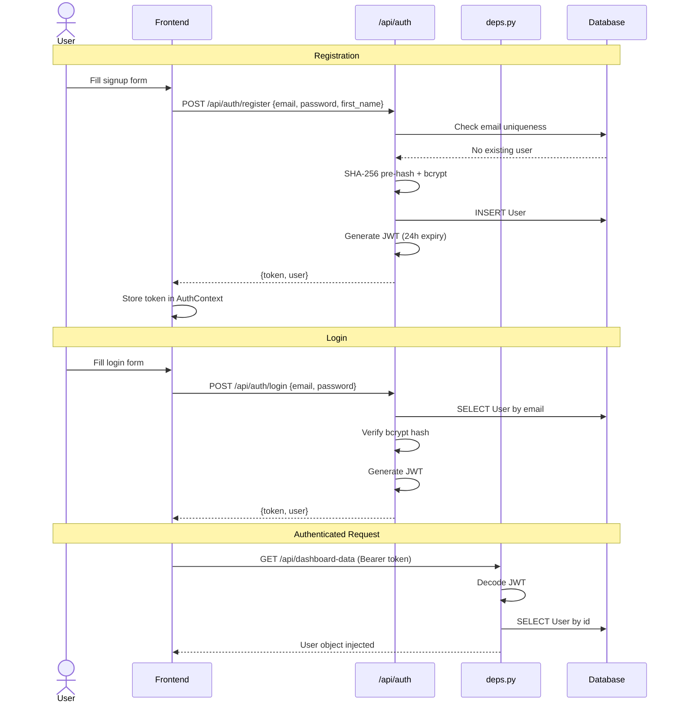

---

## 8. Activity Diagram — Document Parsing (Layer 1)

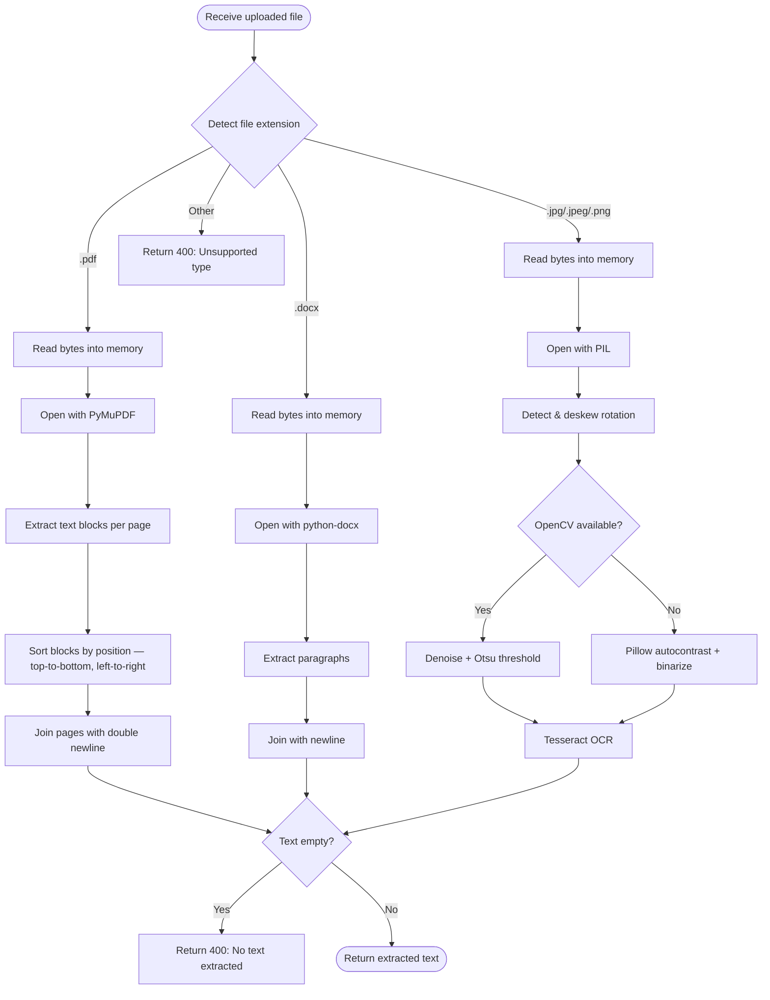

---

## 9. Activity Diagram — LLM Engine Retry & Fallback

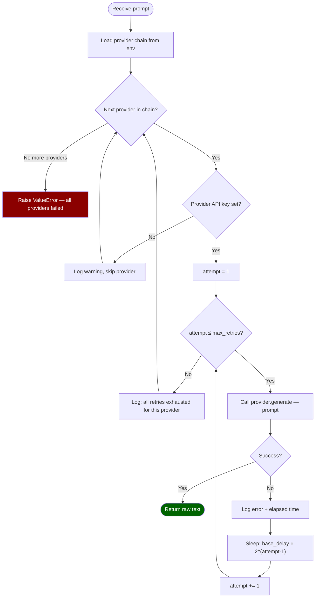

---

## 10. State Diagram — Analysis Lifecycle

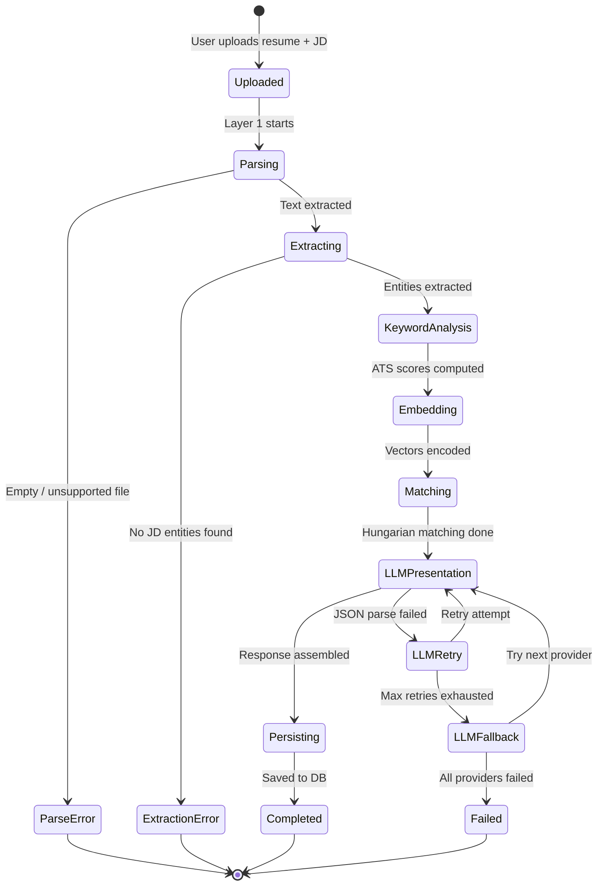

---

## 11. ER Diagram — Database Schema

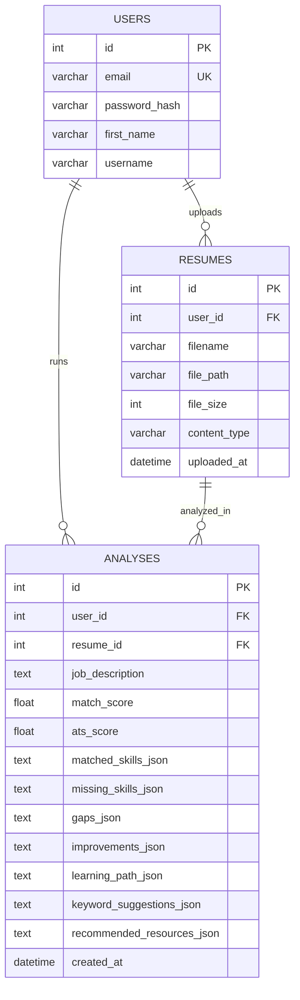

---

## 12. Deployment Diagram

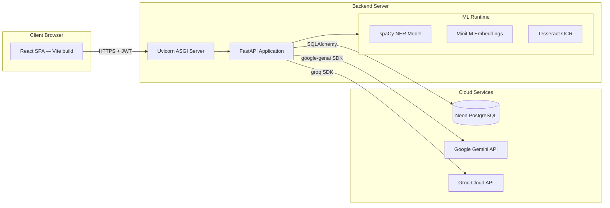

---

## 13. Use Case Diagram

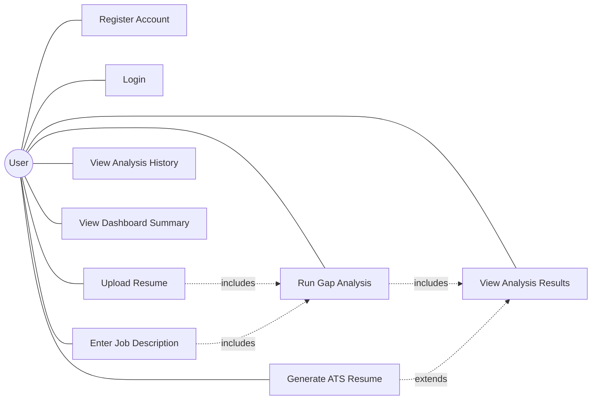

---

## 14. Frontend Component Tree

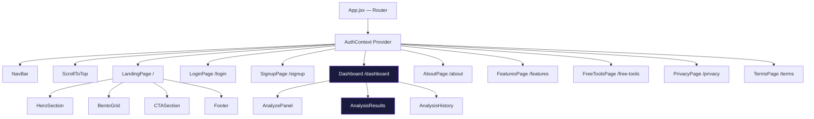

---

## 15. Data Flow Diagram — Full Pipeline

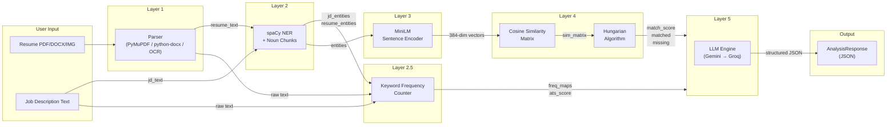

---

## 16. Data Parsing Flow Diagram

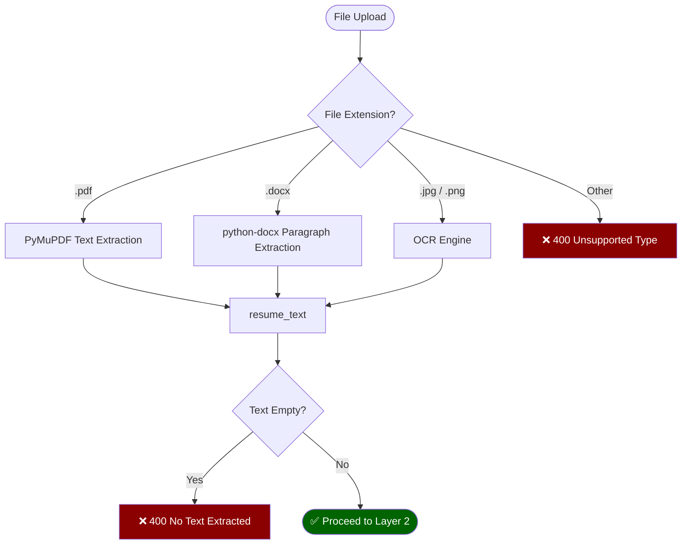

---

*Generated for VibeOnJob — Hybrid NLP+LLM Resume Gap Analyzer*
