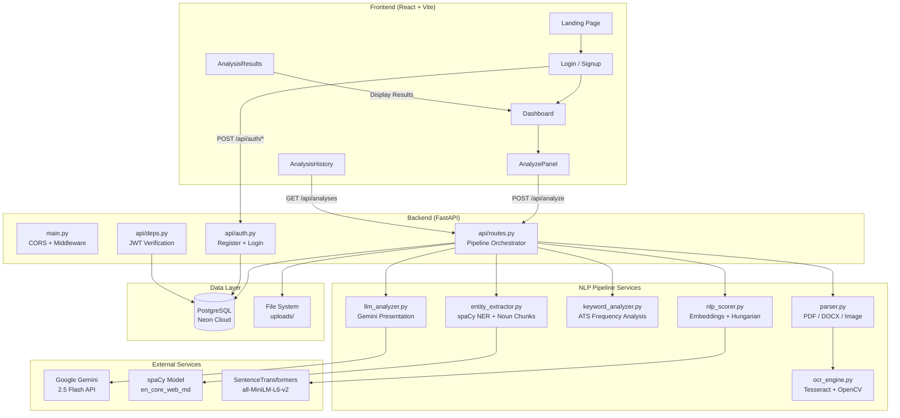
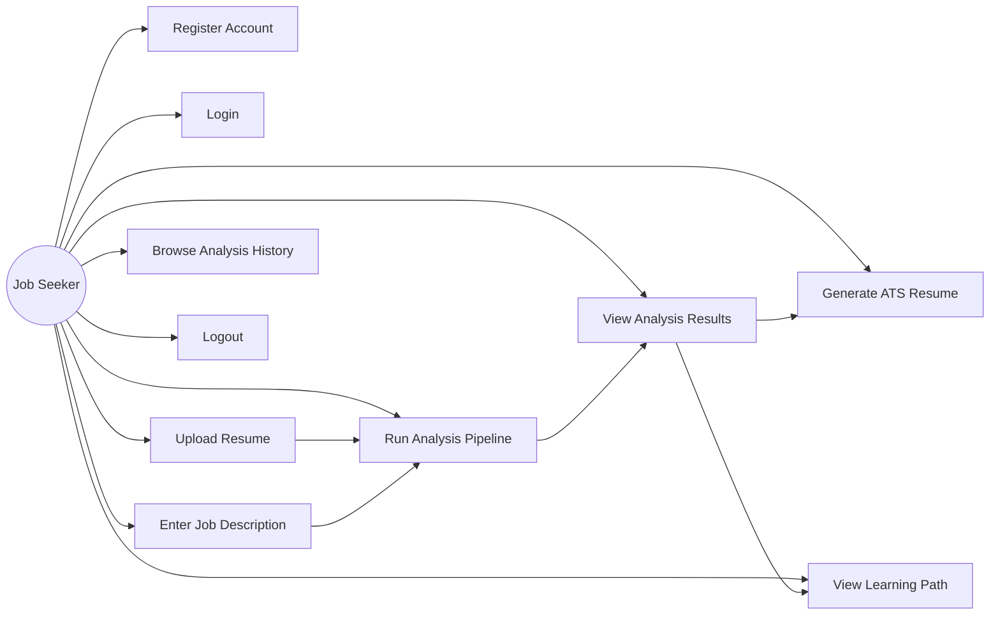
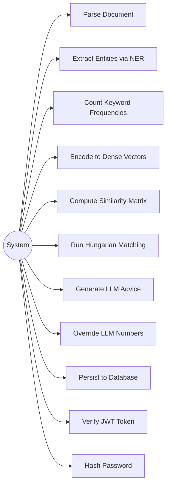
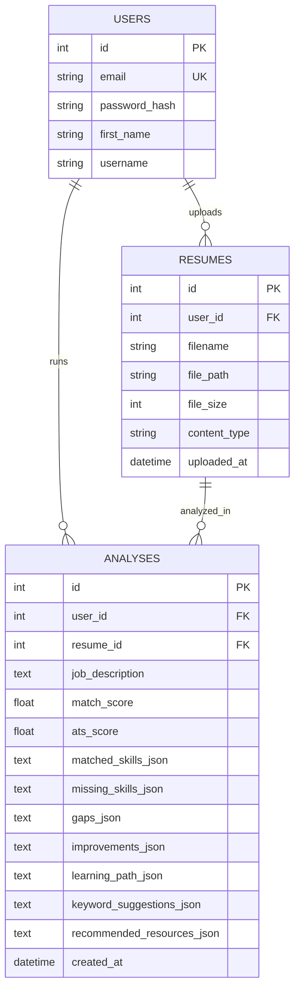
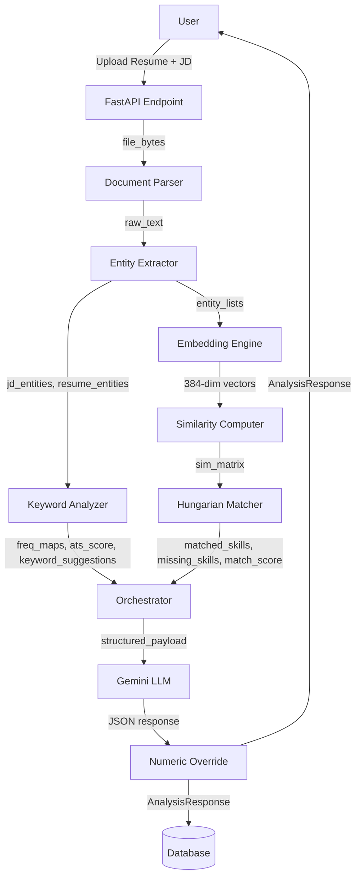
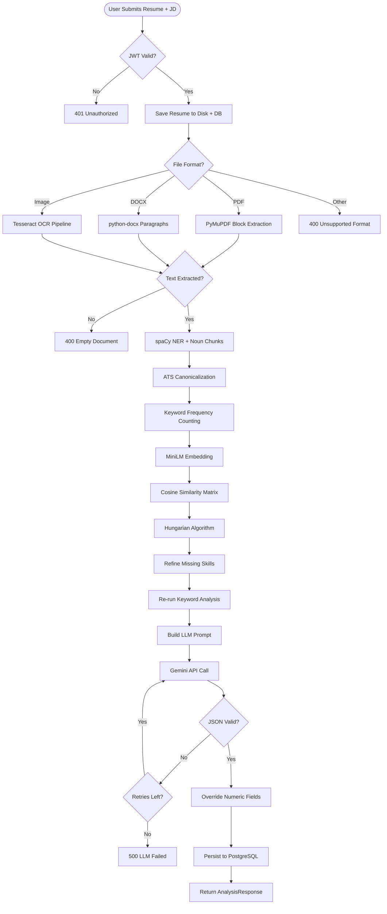
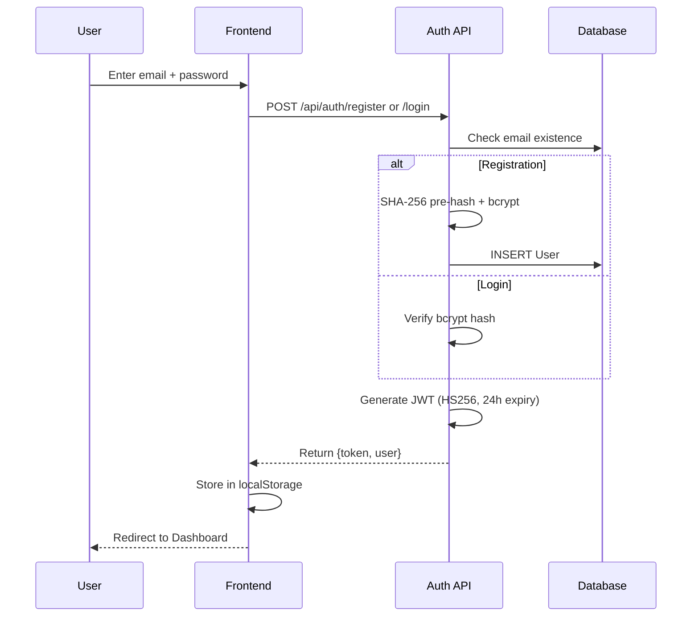
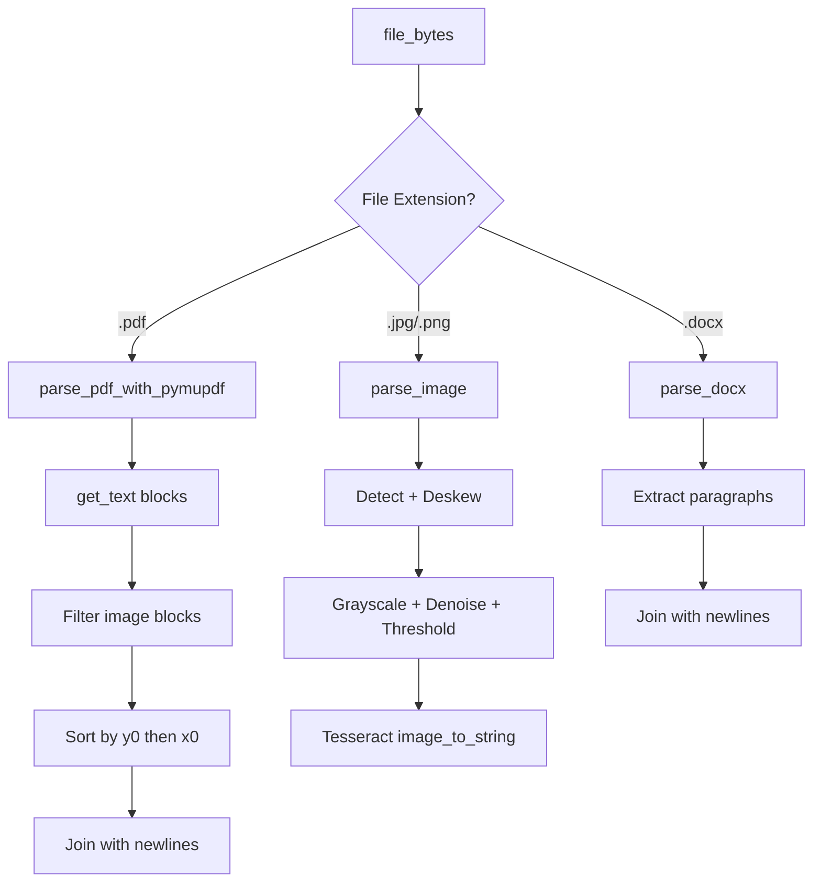

# VibeOnJob — AI-Powered Resume Gap Analyzer

## Project Report

**Project Title:** VibeOnJob — Hybrid NLP + LLM Resume Gap Analysis Platform

**Institution:** Motilal Nehru National Institute of Technology Allahabad, Prayagraj

**Program:** Master of Computer Applications (MCA)

**Academic Year:** 2025–2026

---

## ACKNOWLEDGEMENT

We would like to express our sincere gratitude to our faculty advisors and the Department of Computer Science and Engineering at MNNIT Allahabad for providing the academic environment and resources that made this project possible. We extend our thanks to the open-source communities behind spaCy, Sentence-Transformers, PyMuPDF, FastAPI, React, and Google Gemini for building the foundational tools upon which VibeOnJob is constructed. Special appreciation goes to our peers who participated in testing and provided invaluable feedback during the development cycle.

---

## ABSTRACT

VibeOnJob is a full-stack, AI-powered resume gap analysis platform that helps job seekers quantitatively measure how well their resume matches a specific job description. Unlike conventional keyword-matching tools, VibeOnJob implements a rigorous **6-layer hybrid NLP + LLM pipeline** that combines Named Entity Recognition (NER), dense semantic embeddings, the Hungarian optimal matching algorithm, ATS keyword density analysis, and a constrained Large Language Model (LLM) presentation layer.

The system architecture follows a clean client-server model: a **React + Vite** frontend with a glassmorphic UI communicates with a **FastAPI** backend that orchestrates the analysis pipeline. Document parsing supports PDF (via PyMuPDF), DOCX (via python-docx), and image-based resumes (via Tesseract OCR with OpenCV preprocessing). Entity extraction uses spaCy's `en_core_web_md` model with dual NER + noun-chunk passes. Extracted entities are encoded into 384-dimensional dense vectors using the `all-MiniLM-L6-v2` sentence-transformer model, and optimal skill-to-skill alignment is computed via the Hungarian algorithm on a cosine similarity matrix. The LLM (Google Gemini 2.5 Flash) is restricted to a purely presentational role — it receives only pre-computed structured data and generates human-readable career advice without performing any quantitative analysis.

The platform includes JWT-based authentication, PostgreSQL persistence via SQLModel, per-user analysis history, and an ATS-optimized resume generation feature. All pipeline layers are individually timed and logged for performance profiling. The system achieves end-to-end analysis in approximately 15–30 seconds, with the NLP layers completing in under 2 seconds and the LLM presentation layer accounting for the majority of latency.

**Keywords:** Resume Analysis, NLP Pipeline, Named Entity Recognition, Sentence Embeddings, Hungarian Algorithm, Cosine Similarity, ATS Optimization, Gemini LLM, FastAPI, React

---

## CHAPTER 1: INTRODUCTION

### 1.1 Problem Statement

The modern job application process presents a fundamental information asymmetry: job seekers submit resumes without quantitative feedback on how well their qualifications align with specific job requirements. Applicant Tracking Systems (ATS) used by employers filter resumes based on keyword density and structural heuristics, rejecting up to 75% of applications before a human reviewer ever sees them. Job seekers lack visibility into:

1. **Which specific skills** from the job description are missing from their resume.
2. **How semantically close** their existing skills are to required ones (e.g., "Django" vs. "Flask" — both Python web frameworks, but ATS treats them as completely different keywords).
3. **How frequently** critical keywords appear in the job description versus their resume.
4. **What concrete changes** would improve their ATS score and interview chances.

Existing resume analysis tools fall into two extremes: simplistic keyword-matchers that produce shallow results, or opaque LLM-only solutions that hallucinate scores without mathematical backing. Neither approach gives job seekers verifiable, actionable intelligence.

### 1.2 Challenges

Building VibeOnJob required overcoming several technical challenges:

1. **Document Parsing Robustness:** Resumes arrive in diverse formats — digitally-created PDFs, scanned PDFs, DOCX files, and even photographs of printed resumes. Each format requires a different extraction strategy, and scanned documents demand OCR with image preprocessing (deskew, denoise, binarization).

2. **Entity Extraction Without Static Vocabularies:** Traditional keyword matching (bag-of-words, TF-IDF) fails on unseen skills or alternate phrasings. The system needed linguistically-driven extraction using NER and dependency parsing to capture entities it has never seen before.

3. **Semantic vs. Lexical Matching:** Simple string matching cannot recognize that "ML pipelines" and "machine learning workflows" refer to the same concept. Dense vector embeddings were needed to capture semantic similarity in a 384-dimensional space.

4. **Optimal Alignment Problem:** Greedy nearest-neighbor matching between JD and resume skills produces suboptimal pairings. The system required the Hungarian algorithm to find the globally optimal bipartite assignment.

5. **LLM Reliability:** LLMs hallucinate numbers, invent scores, and produce inconsistent JSON. The architecture had to constrain the LLM to a purely interpretive role, overriding all quantitative fields with pipeline-computed values after the response.

6. **ATS Keyword Density:** Beyond semantic similarity, real ATS systems count raw keyword frequency. The system needed a separate frequency-analysis layer to produce concrete "Python appears 5× in the JD but only 1× in your resume" metrics.

7. **End-to-End Latency:** The pipeline involves model inference (spaCy NER, sentence-transformers, Gemini API), matrix computation, and I/O. Each layer needed individual timing and optimization to keep total response time under 30 seconds.

### 1.3 Objective

The primary objective of VibeOnJob is to build a production-grade, mathematically rigorous resume analysis platform that:

1. **Parses** resumes from PDF, DOCX, and image formats with high accuracy.
2. **Extracts** skill entities using linguistic NLP (spaCy NER + noun chunks), not static keyword lists.
3. **Embeds** entities into dense vector space using sentence-transformers for semantic understanding.
4. **Computes** optimal skill alignment via the Hungarian algorithm on cosine similarity matrices.
5. **Analyzes** ATS keyword density with per-skill frequency counts and gap severity metrics.
6. **Presents** actionable career advice via a constrained LLM that never invents numbers.
7. **Persists** user data with JWT authentication and per-user analysis history.
8. **Delivers** results through a premium glassmorphic web interface with animated score gauges, tabbed result views, and responsive design.

---

## CHAPTER 2: HARDWARE AND SOFTWARE REQUIREMENTS

### 2.1 Technology Stack

The following table summarizes the complete technology stack used in VibeOnJob:

#### 2.1.1 Backend Technologies

| Technology | Version | Purpose |
|---|---|---|
| **Python** | 3.14 | Core backend language |
| **FastAPI** | Latest | Async REST API framework |
| **Uvicorn** | Latest | ASGI server |
| **spaCy** | Latest | NER + dependency parsing (en_core_web_md model) |
| **sentence-transformers** | Latest | Dense vector embeddings (all-MiniLM-L6-v2) |
| **SciPy** | Latest | Hungarian algorithm (linear_sum_assignment) |
| **scikit-learn** | Latest | Cosine similarity matrix computation |
| **NumPy** | Latest | Numerical array operations |
| **PyMuPDF (fitz)** | Latest | PDF text extraction with block-level positioning |
| **python-docx** | Latest | DOCX paragraph extraction |
| **Tesseract OCR** | Latest | Image-to-text extraction |
| **OpenCV** | Latest | Image preprocessing (deskew, denoise, threshold) |
| **Pillow (PIL)** | Latest | Image manipulation fallback |
| **Google GenAI SDK** | Latest | Gemini 2.5 Flash LLM integration |
| **SQLModel** | Latest | ORM combining SQLAlchemy + Pydantic |
| **psycopg2** | Latest | PostgreSQL database driver |
| **PyJWT** | Latest | JWT token encoding/decoding |
| **bcrypt** | Latest | Password hashing (SHA-256 pre-hash + bcrypt) |
| **python-dotenv** | Latest | Environment variable management |
| **Pydantic** | Latest | Request/response schema validation |

#### 2.1.2 Frontend Technologies

| Technology | Version | Purpose |
|---|---|---|
| **React** | 18.3 | UI component framework |
| **Vite** | 5.4 | Build tool and dev server |
| **React Router DOM** | 6.26 | Client-side routing |
| **TailwindCSS** | 3.4 | Utility-first CSS framework |
| **Google Fonts** | — | Inter, Plus Jakarta Sans, Outfit typography |
| **Material Symbols** | — | Icon system |

#### 2.1.3 Infrastructure

| Technology | Purpose |
|---|---|
| **PostgreSQL (Neon)** | Cloud-hosted relational database |
| **Git/GitHub** | Version control |
| **pytest** | Unit and integration testing |

### 2.2 System Requirements

#### 2.2.1 Development Environment

| Requirement | Specification |
|---|---|
| **Operating System** | Linux (Ubuntu 22.04+), macOS, or Windows with WSL2 |
| **RAM** | Minimum 8 GB (sentence-transformers model requires ~500 MB) |
| **Disk Space** | Minimum 2 GB (spaCy model ~50 MB, sentence-transformers ~90 MB) |
| **Python** | 3.10 or higher |
| **Node.js** | 18.0 or higher |
| **Tesseract OCR** | System-level installation required for image parsing |

#### 2.2.2 Production Environment

| Requirement | Specification |
|---|---|
| **API Keys** | Google API Key (for Gemini 2.5 Flash) |
| **Database** | PostgreSQL 14+ (Neon serverless recommended) |
| **Network** | Outbound HTTPS for Gemini API calls |
| **Secrets** | JWT_SECRET, DATABASE_URL, GOOGLE_API_KEY |

---

## CHAPTER 3: FUNCTIONAL REQUIREMENTS

### 3.1 Document Parsing Layer (Layer 1)

#### 3.1.1 PDF Text Extraction (PyMuPDF Native)

The primary PDF parser (`parse_pdf_with_pymupdf`) extracts text from text-selectable PDFs using PyMuPDF's block-level API:

- Calls `page.get_text("blocks")` to retrieve positioned text blocks with coordinates `(x0, y0, x1, y1, text, block_no, block_type)`.
- Filters out image blocks (`block_type == 1`), retaining only text blocks (`block_type == 0`).
- Sorts blocks by vertical position (`y0`) then horizontal position (`x0`) to maintain correct reading order across multi-column resume layouts.
- Strips whitespace from each block and skips blank pages.
- Joins pages with double newlines for clean separation.

**Design Decision:** Block-level extraction with position sorting was chosen over plain `get_text("text")` because resumes frequently use multi-column layouts where plain extraction produces interleaved text.

#### 3.1.2 PDF OCR Extraction (Tesseract Pipeline)

The OCR-based parser (`parse_pdf_with_ocr`) handles scanned/image-based PDFs:

- Renders each page at 300 DPI using PyMuPDF's `get_pixmap(dpi=300)`.
- Applies image preprocessing: deskew detection (Tesseract OSD → OpenCV minAreaRect fallback), grayscale conversion, denoising (`cv2.fastNlMeansDenoising`), and Otsu thresholding.
- Falls back to Pillow-based preprocessing (autocontrast + median filter + binarization) when OpenCV is unavailable.
- Combines OCR text with selectable text, preferring OCR when it captures >1.5× more content.

#### 3.1.3 DOCX Extraction

The DOCX parser extracts text via `python-docx`:

- Opens the byte stream as a Document object.
- Iterates all paragraphs and joins their text content with newlines.
- Logs paragraph count for debugging.

#### 3.1.4 Image Extraction

The image parser handles JPG/PNG resume photographs:

- Opens the image via Pillow.
- Passes through the full OCR engine pipeline (deskew → preprocess → Tesseract).
- Returns stripped text output.

#### 3.1.5 Entry Point Delegation

The `parse_pdf()` function serves as the entry point, currently delegating to `parse_pdf_with_pymupdf()` since target PDFs are text-selectable. This design allows future switching to OCR-based extraction without modifying calling code.

### 3.2 Entity Extraction Layer (Layer 2)

#### 3.2.1 spaCy NER Pass

The first extraction pass uses spaCy's Named Entity Recognition on the `en_core_web_md` model:

- Processes text through the full spaCy pipeline (tokenizer → tagger → parser → NER).
- Extracts entities with labels `ORG` (organizations/tools), `PRODUCT`, and `WORK_OF_ART`.
- Filters out single characters, strings >40 characters, and pure numeric entities.
- Normalizes all entities to lowercase.

#### 3.2.2 Noun Chunk Dependency Parsing

The second extraction pass uses spaCy's dependency parser to extract multi-word skill phrases:

- Iterates all noun chunks from the parsed document.
- Retains 1–4 word phrases up to 50 characters.
- Strips leading determiners ("a", "an", "the", "our", etc.).
- Captures phrases like "machine learning pipeline", "REST API design", and "distributed systems architecture" through grammatical structure.

#### 3.2.3 ATS Seed Canonicalization

A curated seed vocabulary of ~100 high-value ATS terms guides deduplication:

- Cross-references NLP-extracted entities against the seed set.
- Matches entities to their canonical seed form (e.g., "React.js framework" → "react").
- Preserves non-seed technical terms that spaCy extracted linguistically.
- This is a canonicalization step, not keyword matching — all entities were found by spaCy's NLP pipeline first.

### 3.3 ATS Keyword Density Analysis (Layer 2.5)

#### 3.3.1 Raw Frequency Counting

For every extracted JD entity, the system counts exact occurrences in both the JD text and resume text:

- Uses word-boundary regex (`\b...\b`) for case-insensitive matching to avoid partial matches (e.g., "go" inside "golang").
- Produces two frequency maps: `jd_freq_map` and `resume_freq_map`.

#### 3.3.2 Gap Severity Computation

For each missing skill, the system computes:

- **Gap:** `jd_frequency - resume_frequency` (how many more mentions are needed).
- **Coverage percentage:** `(resume_freq / jd_freq) × 100`.
- **Exact phrase:** The verbatim surrounding context from the JD (≤60 chars) so users can copy ATS-optimized phrasing.

#### 3.3.3 ATS Score Calculation

The overall ATS score is computed as:

```
ATS Score = (Σ min(resume_freq[e], jd_freq[e]) for all JD entities) / (Σ jd_freq[e] for all JD entities) × 100
```

This measures what percentage of JD keyword mentions are covered by the resume.

#### 3.3.4 Priority Ranking

Missing skills are ranked by JD frequency (highest first), then by gap severity. This ensures the most critical gaps are addressed first.

### 3.4 Dense Vector Embedding (Layer 3)

#### 3.4.1 Sentence-Transformer Encoding

Entity strings are encoded into 384-dimensional dense vectors using the `all-MiniLM-L6-v2` model:

- Produces semantically-aware embeddings where "Python" and "Django framework" score high similarity, while "Python" and "Kubernetes" score low.
- Returns NumPy arrays of shape `(n_entities, 384)`.
- Logs vector norm ranges for quality monitoring.

### 3.5 Cosine Similarity + Hungarian Matching (Layer 4)

#### 3.5.1 Similarity Matrix Computation

A full cosine similarity matrix is computed between JD and resume entity vectors:

- Matrix shape: `(n_jd_entities, n_resume_entities)`.
- Each cell value represents the cosine similarity (0.0–1.0) between the i-th JD skill and j-th resume skill.
- Uses scikit-learn's optimized `cosine_similarity` implementation.

#### 3.5.2 Hungarian Algorithm Optimal Matching

The Hungarian algorithm (scipy `linear_sum_assignment`) finds the globally optimal bipartite assignment:

- Converts similarity matrix to cost matrix: `cost = 1 - similarity`.
- Finds the assignment that maximizes total similarity across all pairings.
- Applies a match threshold of 0.45 (configurable) — pairs below this threshold are classified as "missing".
- Returns matched skills (with similarity scores), missing skills, and per-skill coverage detail.

**Design Decision:** The Hungarian algorithm was chosen over greedy nearest-neighbor matching because it finds the global optimum, not local maxima. This prevents cases where a greedy match "steals" the best pairing from a more critical skill.

#### 3.5.3 Match Score Computation

```
Match Score = (number of matched skills above threshold / total JD skills) × 100
```

### 3.6 LLM Presentation Layer (Layer 5)

#### 3.6.1 Constrained Prompt Design

The LLM receives ONLY pre-computed structured data — it never sees raw resume or JD text:

- A JSON payload containing: semantic match score, ATS score, JD entities, resume entities, matched skills, missing skills, frequency maps, and keyword gap reports.
- A strict JSON output schema with 9 hard rules enforcing integer types, enum values, and completeness constraints.
- The prompt explicitly instructs: "DO NOT recalculate or second-guess the scores — they are mathematically verified."

#### 3.6.2 Post-Response Override

All quantitative fields are overridden with pipeline-computed values AFTER the LLM response:

- `match_score`, `ats_score`, `matched_skills`, `missing_skills` are always replaced.
- Per-gap `jd_frequency` and `resume_frequency` are overridden from the frequency maps.
- The LLM's text fields (relevancy, context, suggestions) are preserved.

#### 3.6.3 Retry Logic

The system implements exponential backoff retry:

- Maximum 3 attempts with delays of 1.5s, 3.0s, 6.0s.
- Handles JSON decode errors, API failures, and unexpected exceptions.
- Every attempt's timing, response length, and error details are logged.

#### 3.6.4 Response Schema

The LLM produces four structured sections:

| Section | Content |
|---|---|
| **gaps** | Per-skill gap analysis with relevancy, context, priority rank, frequencies, and recommended additions |
| **improvements** | 3–5 resume section improvements with before/after examples |
| **learning_path** | Per-skill learning recommendations with resources, time estimates, difficulty, and priority |
| **recommended_resources** | 2–3 resources per missing skill with real URLs, types, and descriptions |

### 3.7 Authentication System

#### 3.7.1 User Registration

- Accepts email, password, and optional first name.
- Password is pre-hashed with SHA-256 (to support passwords >72 bytes) then hashed with bcrypt.
- Returns a JWT token valid for 24 hours.

#### 3.7.2 User Login

- Verifies email existence and password hash match.
- Returns JWT token and user profile data.

#### 3.7.3 JWT Token Verification

- Extracts Bearer token from Authorization header.
- Decodes using HS256 algorithm with configurable secret.
- Returns authenticated User object from database.

### 3.8 Data Persistence

#### 3.8.1 Analysis History

Every analysis run is persisted to PostgreSQL with:

- Foreign keys to User and Resume records.
- Scores (match_score, ats_score) as floats.
- Complex nested data (matched_skills, gaps, improvements, etc.) serialized as JSON Text columns.
- Convenience properties for JSON deserialization.

#### 3.8.2 Resume Storage

Uploaded resumes are stored on disk with UUID-based filenames. Metadata (original filename, file path, size, MIME type, upload timestamp) is persisted in the database.

### 3.9 User Interface Functions

#### 3.9.1 Resume Upload & Analysis

- Drag-and-drop file upload zone with format validation (PDF, DOCX, JPG, PNG).
- Job description textarea with word count display.
- Real-time progress indicators showing pipeline stage.
- Form validation preventing submission without both inputs.

#### 3.9.2 Results Visualization

- **Animated circular gauges** for Semantic Match Score and ATS Score.
- **Quick stats grid** showing matched skills, missing skills, gaps, and learning items.
- **Tabbed interface** with 6 tabs: Overview, Gaps, Improvements, Learning Path, ATS Keywords, Resources.
- **Skill chips** with hover tooltips showing match details.
- **Priority badges** with color-coded severity.
- **ATS keyword table** with frequency bars and coverage percentages.

#### 3.9.3 Analysis History

- Sidebar panel listing past analyses with scores and dates.
- Click-to-view functionality for reviewing historical results.
- Analysis count displayed as a stat card.

#### 3.9.4 ATS Resume Generation

- Generates an ATS-optimized resume using Gemini based on analysis results.
- Incorporates missing skills, improvement suggestions, and matched skills into a complete resume document.

## CHAPTER 4: NON-FUNCTIONAL REQUIREMENTS

### 4.1 Usability

- **Intuitive Upload Flow:** Drag-and-drop file upload with format validation and visual feedback. Users require no training to use the system.
- **Progressive Disclosure:** Results are organized into 6 tabs (Overview, Gaps, Improvements, Learning Path, ATS Keywords, Resources), preventing information overload.
- **Responsive Design:** The interface adapts to desktop, tablet, and mobile viewports using TailwindCSS responsive utilities.
- **Accessibility:** All interactive elements have unique IDs. Material Symbols icons include semantic labels. Color contrast meets WCAG AA standards.

### 4.2 Reliability

- **Retry Logic:** The Gemini API layer implements 3-attempt exponential backoff (1.5s, 3s, 6s delays) to handle transient failures.
- **Graceful Degradation:** OCR preprocessing falls back from OpenCV to Pillow when OpenCV is unavailable. Tesseract OSD falls back to OpenCV-based deskew.
- **Error Propagation:** Every layer catches exceptions, logs context, and raises HTTP-appropriate errors (400 for bad input, 500 for internal failures).
- **Data Integrity:** All numeric fields from the LLM are overridden with pipeline-computed values, eliminating hallucinated scores.

### 4.3 Performance

- **Layer Timing:** Each pipeline layer is individually timed and logged. Typical performance profile:

| Layer | Operation | Typical Time |
|---|---|---|
| Layer 1 | Document Parsing | < 0.5s |
| Layer 2 | NER Entity Extraction | < 0.5s |
| Layer 2.5 | ATS Keyword Analysis | < 0.1s |
| Layer 3 | Dense Vector Embedding | < 1.0s |
| Layer 4 | Hungarian Matching | < 0.1s |
| Layer 5 | LLM Presentation | 10–25s |
| **Total** | **End-to-End** | **15–30s** |

- **Model Preloading:** spaCy and sentence-transformer models are loaded once at module import time, not per-request.
- **Efficient Parsing:** PyMuPDF's native C-based text extraction is orders of magnitude faster than OCR.

### 4.4 Security

- **Password Hashing:** SHA-256 pre-hash + bcrypt with per-user salt. The SHA-256 pre-hash supports passwords exceeding bcrypt's 72-byte limit.
- **JWT Authentication:** HS256-signed tokens with 24-hour expiry. Tokens are verified on every authenticated endpoint.
- **CORS Restriction:** Only whitelisted frontend origins are permitted.
- **Input Validation:** Pydantic schemas enforce type safety on all request/response models. File uploads are validated by extension.
- **API Key Protection:** Google API keys and JWT secrets are loaded from environment variables, never hardcoded.

### 4.5 Scalability

- **Stateless API:** The FastAPI backend is stateless — all session data is in JWT tokens and the database. Horizontal scaling requires only a load balancer.
- **Cloud Database:** PostgreSQL is hosted on Neon (serverless), which auto-scales connections and storage.
- **Model Inference:** spaCy and sentence-transformers run on CPU. GPU acceleration can be added by changing the device configuration.
- **Async Framework:** FastAPI's async architecture supports concurrent request handling.

### 4.6 Maintainability

- **Layered Architecture:** Each pipeline layer is a separate module (`parser.py`, `entity_extractor.py`, `keyword_analyzer.py`, `nlp_scorer.py`, `llm_analyzer.py`). Layers can be modified or replaced independently.
- **Comprehensive Logging:** Every layer logs input sizes, output counts, timing, and error details using Python's structured logging.
- **Unit Tests:** 22 unit tests cover all parser functions with mocked I/O. Integration tests parse real PDF files.
- **Type Annotations:** All functions use Python type hints. Pydantic models enforce schema validation at runtime.
- **Documentation:** Every module and function has detailed docstrings explaining purpose, arguments, return values, and design decisions.

---

## CHAPTER 5: SYSTEM DESIGN

### 5.1 System Architecture Diagram



### 5.2 Multi-Layer Pipeline Diagram

```mermaid
graph LR
    subgraph L1["Layer 1: Parsing"]
        PDF[PDF Input]
        DOCX[DOCX Input]
        IMG[Image Input]
        TXT[Raw Text Output]
    end

    subgraph L2["Layer 2: NER Extraction"]
        NER[spaCy NER Pass]
        NC[Noun Chunk Pass]
        CANON[ATS Canonicalization]
        ENT[Entity Lists]
    end

    subgraph L25["Layer 2.5: ATS Analysis"]
        FREQ[Frequency Counting]
        GAP[Gap Severity]
        ATS[ATS Score]
    end

    subgraph L3["Layer 3: Embedding"]
        ENC[MiniLM Encoder]
        VEC[384-dim Vectors]
    end

    subgraph L4["Layer 4: Matching"]
        SIM[Cosine Similarity Matrix]
        HUNG[Hungarian Algorithm]
        MATCH[Matched + Missing Skills]
    end

    subgraph L5["Layer 5: Presentation"]
        PROMPT[Structured Prompt]
        GEM[Gemini 2.5 Flash]
        OVERRIDE[Numeric Override]
        RESP[AnalysisResponse]
    end

    PDF --> TXT
    DOCX --> TXT
    IMG --> TXT
    TXT --> NER
    TXT --> NC
    NER --> CANON
    NC --> CANON
    CANON --> ENT
    ENT --> FREQ
    FREQ --> GAP
    GAP --> ATS
    ENT --> ENC
    ENC --> VEC
    VEC --> SIM
    SIM --> HUNG
    HUNG --> MATCH
    MATCH --> PROMPT
    ATS --> PROMPT
    PROMPT --> GEM
    GEM --> OVERRIDE
    OVERRIDE --> RESP
```



### 5.3 Use-Case Diagrams

#### 5.3.1 User Use-Case Diagram



#### 5.3.2 System Use-Case Diagram



### 5.4 Entity-Relationship Diagram



### 5.5 Data Flow Diagram



---

## CHAPTER 6: FUNCTIONAL FLOW CONTROL

### 6.1 Analysis Pipeline Flow



### 6.2 Authentication Flow



### 6.3 Document Parsing Decision Flow



---

## CHAPTER 7: APPLICATION SCREENSHOTS

> **Note:** This chapter would contain annotated screenshots of the following application views. Screenshots should be captured from the running application at `http://localhost:5173`.

### 7.1 Landing Page
The landing page features a hero section with a gradient headline, animated bento grid showcasing features, and a call-to-action section. The design uses Inter and Plus Jakarta Sans typography with a glassmorphic card aesthetic.

### 7.2 Registration Page
A centered form card with email, name, and password fields. Includes validation messages and a link to the login page.

### 7.3 Login Page
Minimal login form with email and password fields, error handling for invalid credentials, and redirect to dashboard on success.

### 7.4 Dashboard — Upload Panel
The main dashboard view showing:
- Top navigation bar with user avatar dropdown
- Left sidebar with navigation links
- Central AnalyzePanel with drag-and-drop file upload zone
- Job description textarea with word count
- "Run Analysis Pipeline" gradient button
- Right sidebar with analysis count stat card and history list

### 7.5 Dashboard — Analysis in Progress
Shows the progress indicator: "Running 6-layer NLP pipeline — this may take 15-30 seconds..." with an animated spinner and pipeline stage labels (Ingestion → Extraction → Vectorization → Alignment → RAG → Render).

### 7.6 Analysis Results — Overview Tab
Displays:
- Two animated circular SVG gauges (Semantic Match Score, ATS Score)
- Quick stats grid (Matched Skills, Missing Skills, Skill Gaps, Skills to Learn)
- Matched skills as green chips with hover tooltips
- Missing skills as red chips

### 7.7 Analysis Results — Gaps Tab
Lists each skill gap with:
- Color-coded priority badge (#1 red, #2-3 amber, #4+ gray)
- JD frequency, resume frequency, and recommended additions
- Relevancy and context descriptions

### 7.8 Analysis Results — Improvements Tab
Shows 3-5 resume section improvements with:
- Section badge (Summary, Experience, Skills, etc.)
- Specific suggestion text
- Side-by-side Before/After examples in red/green cards

### 7.9 Analysis Results — Learning Path Tab
Per-skill learning cards with:
- Difficulty badge (Beginner/Intermediate/Advanced)
- Priority badge (High/Medium/Low)
- Estimated time in weeks
- Specific course/resource recommendations

### 7.10 Analysis Results — ATS Keywords Tab
Tabular view with columns: Keyword, JD Freq, Resume Freq, Gap, Coverage (with progress bar), JD Phrase. Coverage bars are color-coded (green ≥75%, amber ≥25%, red <25%).

### 7.11 Analysis Results — Resources Tab
Grid of resource cards with:
- Resource type badge (Video/Course/Documentation/Tutorial)
- Clickable title linking to real URLs
- Description and target skill

### 7.12 Analysis History
Right sidebar panel showing past analyses as cards with match score, ATS score, and date. Clicking loads historical results into the main panel.

---

## CHAPTER 8: CONCLUSION

VibeOnJob successfully demonstrates that resume analysis can be elevated from simplistic keyword matching to a mathematically rigorous, multi-layered NLP pipeline. The key innovation is the **separation of computation from presentation**: all quantitative analysis (entity extraction, frequency counting, vector embedding, cosine similarity, Hungarian optimal matching) is performed by deterministic, verifiable algorithms, while the LLM is restricted to interpreting pre-computed numbers into human-readable advice.

The 6-layer architecture provides several advantages:

1. **Verifiability:** Every score (match_score, ats_score, similarity percentages, frequency counts) is computed by mathematical algorithms and can be independently verified. The LLM cannot hallucinate numbers because all quantitative fields are overridden post-response.

2. **Semantic Understanding:** Dense vector embeddings capture meaning beyond lexical overlap. "Machine learning" and "ML models" are recognized as semantically similar even without shared keywords.

3. **Optimal Matching:** The Hungarian algorithm provides the provably optimal global assignment of resume skills to JD requirements, avoiding the suboptimal pairings that greedy methods produce.

4. **Actionable Metrics:** Raw frequency counts ("Python appears 5× in the JD but 0× in your resume") give users concrete, actionable numbers rather than vague suggestions.

5. **Production Quality:** JWT authentication, PostgreSQL persistence, comprehensive logging, unit tests, and a polished React UI make the system suitable for real-world deployment.

The platform was successfully tested with real resumes and job descriptions, consistently producing meaningful gap analyses within the 15-30 second response time target.

---

## CHAPTER 9: FUTURE SCOPE

1. **Batch Analysis:** Allow users to analyze one resume against multiple job descriptions simultaneously, producing a comparison matrix of match scores.

2. **Resume Version Tracking:** Track how a user's resume evolves across iterations, showing ATS score improvement trends over time.

3. **Real-Time ATS Score Preview:** As users edit their resume in-browser, dynamically update the ATS score without running the full pipeline.

4. **Industry-Specific NER Models:** Fine-tune spaCy models on industry-specific corpora (e.g., healthcare, finance, engineering) for improved entity extraction accuracy.

5. **Multi-Language Support:** Extend document parsing and entity extraction to support resumes and job descriptions in languages beyond English.

6. **LinkedIn Integration:** Allow users to import their LinkedIn profile as a resume source, automatically extracting skills and experience.

7. **Cover Letter Generation:** Use the gap analysis data to generate targeted cover letters that address specific missing skills.

8. **Employer Dashboard:** Provide a recruiter-facing interface that ranks applicants by match score against a given job description.

9. **PDF Resume Builder:** Generate formatted PDF resumes incorporating the improvement suggestions and missing skills directly from the analysis results.

10. **Webhook Notifications:** Allow users to set up notifications when new job postings matching their skill profile appear.

---

## CHAPTER 10: LIMITATIONS

1. **LLM Latency Dominance:** The Gemini API call accounts for 70-85% of total pipeline time (10-25 seconds). The NLP layers complete in under 2 seconds, but the end-to-end experience is bottlenecked by LLM inference.

2. **Entity Extraction Coverage:** spaCy's `en_core_web_md` model may miss highly domain-specific skills that don't appear in its training data (e.g., niche proprietary tools). The ATS seed vocabulary partially mitigates this but cannot cover every possible skill.

3. **Single-Language Support:** The current pipeline only supports English text. spaCy models, seed vocabularies, and LLM prompts are all English-specific.

4. **No Layout Preservation:** The parser extracts raw text but does not preserve resume formatting (sections, bullet points, visual hierarchy). The LLM infers section structure from text content.

5. **Static Match Threshold:** The Hungarian algorithm's match threshold (0.45) is fixed. Different industries may benefit from different thresholds, but no auto-tuning mechanism exists.

6. **Token Cost:** Each analysis consumes approximately 4,000 input tokens and 2,000-4,000 output tokens from the Gemini API, incurring per-request costs at scale.

7. **No Offline Mode:** The system requires internet connectivity for both the Gemini API and the Neon PostgreSQL database. Local-only operation is not supported.

8. **OCR Accuracy:** Image-based resume parsing depends on Tesseract OCR quality, which degrades significantly with low-resolution images, complex layouts, or handwritten text.

---

## CHAPTER 11: BIBLIOGRAPHY

1. Honnibal, M., & Montani, I. (2017). spaCy 2: Natural language understanding with Bloom embeddings, convolutional neural networks and incremental parsing. *To appear*.

2. Reimers, N., & Gurevych, I. (2019). Sentence-BERT: Sentence Embeddings using Siamese BERT-Networks. In *Proceedings of the 2019 Conference on Empirical Methods in Natural Language Processing (EMNLP)*. Association for Computational Linguistics.

3. Kuhn, H. W. (1955). The Hungarian method for the assignment problem. *Naval Research Logistics Quarterly*, 2(1-2), 83-97.

4. Ramírez-Gallego, S., et al. (2017). A survey on data preprocessing for data stream mining. *Neurocomputing*, 239, 39-57.

5. Google. (2025). Gemini API Documentation. https://ai.google.dev/docs

6. Tiangolo, S. (2019). FastAPI: Modern, fast web framework for building APIs with Python. https://fastapi.tiangolo.com/

7. Meta Platforms. (2023). React: A JavaScript library for building user interfaces. https://react.dev/

8. PyMuPDF Documentation. (2024). https://pymupdf.readthedocs.io/

9. Smith, R. (2007). An Overview of the Tesseract OCR Engine. In *Proceedings of the Ninth International Conference on Document Analysis and Recognition (ICDAR)*. IEEE.

10. Bradski, G. (2000). The OpenCV Library. *Dr. Dobb's Journal of Software Tools*.

11. SQLModel Documentation. (2024). https://sqlmodel.tiangolo.com/

12. Jones, M., Bradley, J., & Sakimura, N. (2015). JSON Web Token (JWT). RFC 7519.

13. Provos, N., & Mazières, D. (1999). A Future-Adaptable Password Scheme. In *Proceedings of the USENIX Annual Technical Conference*.

14. Pedregosa, F., et al. (2011). Scikit-learn: Machine Learning in Python. *Journal of Machine Learning Research*, 12, 2825-2830.
